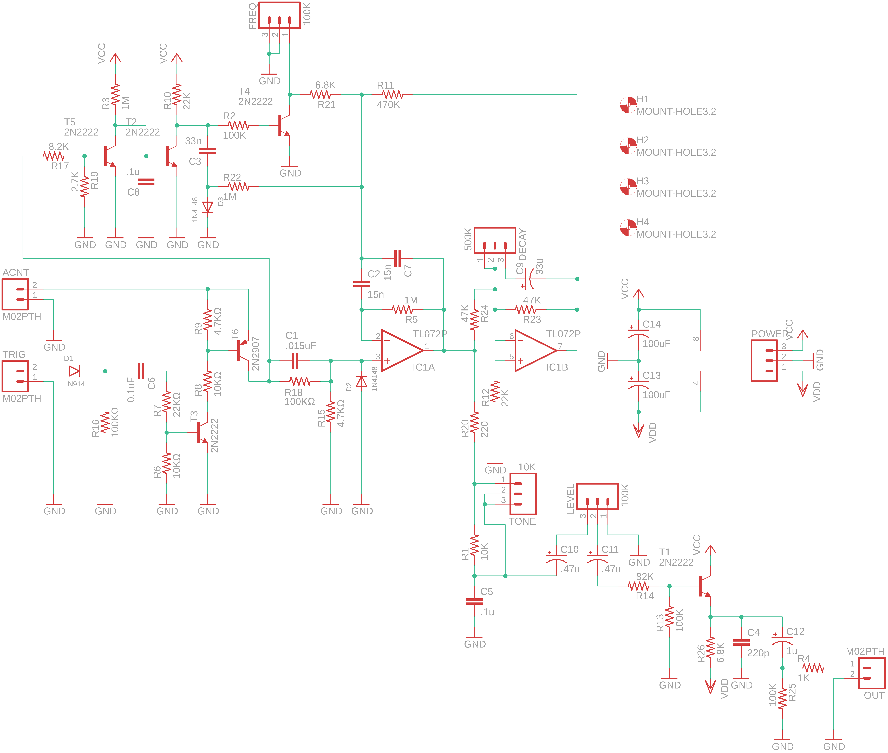
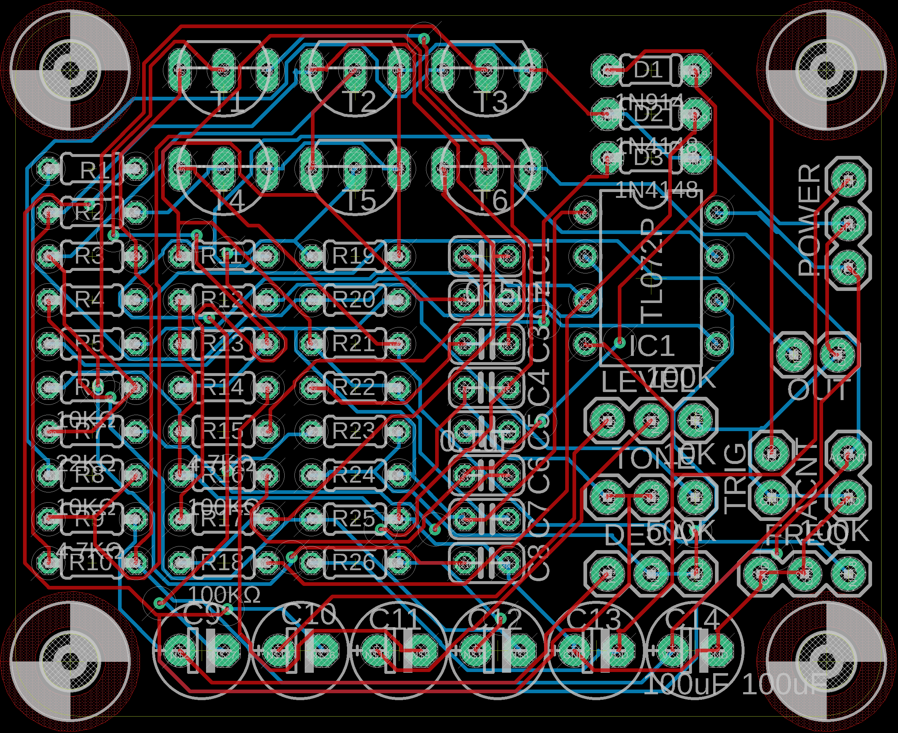

# heart-beat
A redesigned 808-synth clone

After hearing Ke$ha ask "do i make your heart beat like an 808 drum", I realized that I had no idea what an 808 drum sounded like. The parts to build a clone aren't that expensive.

This design was built, tested, and is working. It had an issue with the Accent ability that needs attention.

